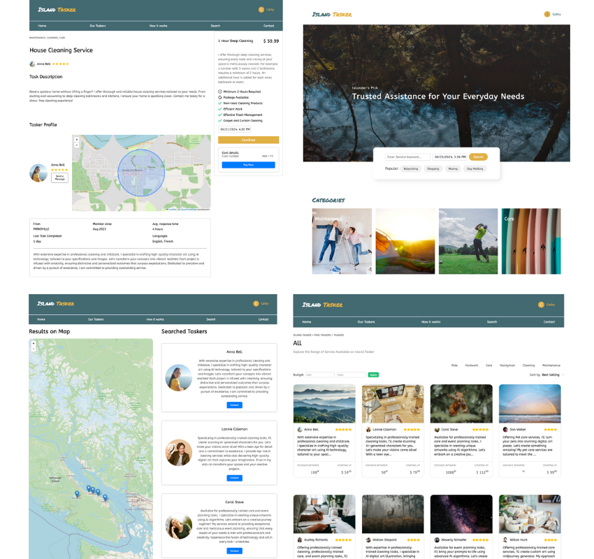

# IslandTasker

[Island Tasker Demo](https://islandtasker.netlify.app/) |
[Claire's Portfolio](https://jclairelee.com/Portfolio)

IslandTasker bridges the gap between individuals in need of daily chore assistance and service providers. Inspired by the needs of seniors and busy parents in a small town, it simplifies the task of finding reliable help.

## Features

- **Location-Based Services:** Connects service needs with local providers in Central Vancouver Island.
- **Reliable Help:** Provides a trusted platform for seniors and busy parents to find chore assistance.
- **Distance Calculation:** Utilizes Geolib for accurate distance calculations between service providers and requesters.
- **Payment Integration:** Utilizes Stripe for secure and easy payment processing.

## Screenshots



## Technologies Used

- **React:** A JavaScript library for building user interfaces.
- **Sass:** A CSS preprocessor to make stylesheets more maintainable.
- **Proj4:** A library for coordinate system transformations.
- **Geolib:** A library for geospatial calculations.
- **Firebase:** A platform for building web and mobile applications.
- **Leaflet:** An open-source JavaScript library for interactive maps.
- **Stripe:** A technology for secure payment processing.
- **Parksville, Qualicum Beach Address Points Open Data:** Public geoJson data for addressing points in Central Vancouver Island.

## Data Sources

IslandTasker is a location-based platform that utilizes public addressing points geoJson data to connect service needs with local providers in Central Vancouver Island. The platform leverages public data sourced from cities in Central Vancouver Island for addressing points and employs Proj4 for coordinate system conversion. Geolib is utilized for calculating distances using its coordinate library.

## Getting Started

### Prerequisites

- Node.js
- npm (Node Package Manager)
- Firebase account
- Stripe account

### Installation

1. Clone the repository:

   ```bash
   git clone https://github.com/your-username/IslandTasker.git
   ```

2. Navigate to the project directory:

   ```bash
   cd IslandTasker
   ```

3. Install dependencies:
   ```bash
   npm install
   ```

### Running the Application

1. Start the development server:

   ```bash
   npm start
   ```

2. Open your browser and visit `http://localhost:3000`.

## Credits

Developed by Claire.
If you have any questions, feel free to [send an email](mailto:jclairelee2@email.com).
